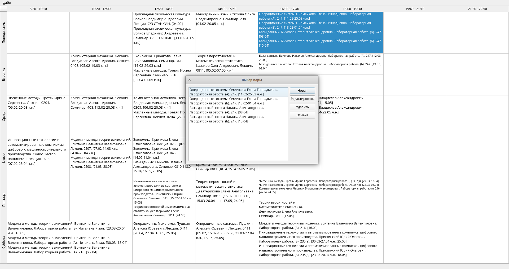
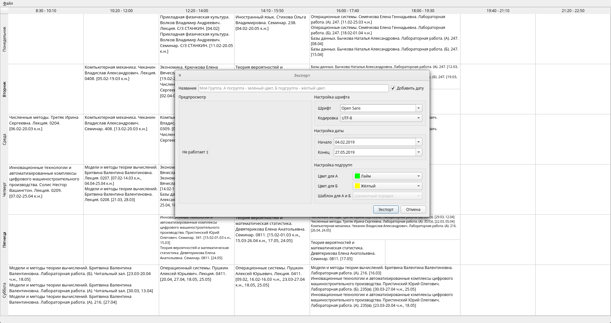

# Stankin Schedule Editor

The project is designed to create a weekly schedule in the form of pdf-files.

## Requirements

- Python 3.X
- PyQt5
- PyFPDF2
- OpenCV
- NumPy
- PDF2Image

##### External modules:

- [Tesseract OCR](https://github.com/tesseract-ocr/tesseract)
- [Poopler](https://poppler.freedesktop.org/)

Also you can use:

`` pip install -r requirements.txt ``

## Screenshots

